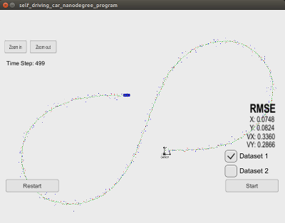

# Extended Kalman Filter Project
### Self-Driving Car Engineer Nanodegree Program
# 
#

In this project we utilize an Unscented Kalman filter to estimate the state of a moving object of interest with noisy lidar and radar measurements. 

This project involves the Term 2 Simulator which can be downloaded [here](https://github.com/udacity/self-driving-car-sim/releases)

This project requires uWebSocketIO library. Once the install for uWebSocketIO is complete, the main program can be built and run by doing the following from the project top directory.

1. mkdir build
2. cd build
3. cmake ..
4. make
5. ./UnscentedKF 

## Other Important Dependencies

* cmake >= 3.5
  * All OSes: [click here for installation instructions](https://cmake.org/install/)
* make >= 4.1 (Linux, Mac), 3.81 (Windows)
  * Linux: make is installed by default on most Linux distros
  * Mac: [install Xcode command line tools to get make](https://developer.apple.com/xcode/features/)
  * Windows: [Click here for installation instructions](http://gnuwin32.sourceforge.net/packages/make.htm)
* gcc/g++ >= 5.4
  * Linux: gcc / g++ is installed by default on most Linux distros
  * Mac: same deal as make - [install Xcode command line tools](https://developer.apple.com/xcode/features/)
  * Windows: recommend using [MinGW](http://www.mingw.org/)

## Results
# 

#
# Unscented Results from Project 2
#

|   .	| Radar Only 	| Lidar Only  	|  Radar + Lidar 	|
|------	|-----	|-----	|-----	|
|  x 	| 0.1606 | 0.1301 	|   0.0748  |
|  y 	| 0.2267 | 0.0979  	|   0.0824	|
|  vx 	| 0.4156 | 0.6786	|   0.3360  |   	
|  vy 	| 0.4200 | 0.2690  	|   0.2866	|

